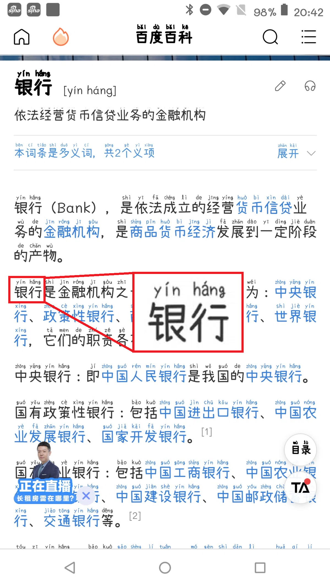

# Mengshen Pinyin Font（萌神拼音字体）

支持多音字的 OSS 拼音字体及其制作工具。

OpenSource Pinyin font and creation tool that supports homographs (多音字).

[](https://github.com/MaruTama/Mengshen-pinyin-font/releases/tag/v20260712-013306)


> 日本語版: [README_ja.md](./README_ja.md)

----

## 目录 / Contents

- [字体预览 / Font Preview](#字体预览--font-preview)
- [特点 / Features](#特点--features)
- [字体变体 / Font Variants](#字体变体--font-variants)
- [下载 / Download](#下载--download)
- [安装方法 / Installation](#安装方法--installation)
- [使用示例 / Use Cases](#使用示例--use-cases)
- [多音字原理 / How Homographs Work](#多音字原理--how-homographs-work)
- [平台兼容性 / OS Compatibility](#平台兼容性--os-compatibility)
- [指南 / Guides](#指南--guides)
- [支持的多音字列表 / Homograph List](#支持的多音字列表--homograph-list)
- [构建字体 / Building the Fonts](#构建字体--building-the-fonts)
- [关于项目 / About](#关于项目--about)
- [致谢 / Acknowledgments](#致谢--acknowledgments)
- [打赏 / Donate](#打赏--donate)

----

## 字体预览 / Font Preview


----

## 特点 / Features

支持日语、简体中文、繁体中文显示的字体。
简体字和繁体字自动标注拼音。
多音字（同一汉字有多个读音）根据上下文自动切换读音。
主要面向中文、日语学习者。

A font that displays Japanese, Simplified Chinese, and Traditional Chinese characters.
Pinyin is automatically annotated for Simplified and Traditional Chinese characters.
Homographs (多音字) — characters with multiple readings — are automatically switched based on context.
Intended for learners of Chinese and Japanese.

- 16,026个汉字自动标注拼音 / Automatic pinyin for 16,026 characters
- 多音字根据上下文自动切换 / Context-aware homograph (多音字) switching
- 支持通过 IVS 手动切换 / Manual switching via Unicode IVS
- 支持简体字、繁体字、日语汉字、平假名、片假名 / Simplified, Traditional, Japanese, Hiragana, Katakana
- 两种风格（宋体、手写体） / Two styles (Serif, Handwritten)

----

## 字体变体 / Font Variants

| 变体 / Variant | 风格 / Style | 字重 / Weights | 基础字体 / Based on |
| :-: | :-: | :-: | :-: |
| Mengshen-HanSerif | 宋体 / Serif | 7 (ExtraLight–Heavy) | Source Han Serif + M+ M Type-1 |
| Mengshen-Handwritten | 手写体 / Handwritten | Regular | Xiaolai Font + SetoFontSP |

宋体支持思源宋体的七种字重。手写体的基础字体只有一种字重。

The serif variant can be built in all seven Source Han Serif weights
(ExtraLight, Light, Regular, Medium, SemiBold, Bold, Heavy). The handwritten
variant is Regular only, since its base fonts ship a single weight.

----

## 下载 / Download

**[Download/下载](https://github.com/MaruTama/Mengshen-pinyin-font/releases)**

----

## 安装方法 / Installation

- [macOS](https://support.apple.com/en-us/HT201749)
- [Windows](https://support.microsoft.com/en-us/help/314960/how-to-install-or-remove-a-font-in-windows)
- [Linux/Unix-based systems](https://github.com/adobe-fonts/source-code-pro/issues/17#issuecomment-8967116)
- [Android](./docs/HOW_TO_APPLY_FONT_ON_ANDROOID.md)

----

## 使用示例 / Use Cases

可在微博、Netflix、歌词、新闻、MS Word 等场景中使用。

You can use this font in Weibo, Netflix, Lyrics, News, MS Word, and more.

与 [Language Learning with Netflix](https://chrome.google.com/webstore/detail/language-learning-with-ne/hoombieeljmmljlkjmnheibnpciblicm?hl=en) 配合使用，可在字幕中同时显示汉字和拼音。

Combined with [Language Learning with Netflix](https://chrome.google.com/webstore/detail/language-learning-with-ne/hoombieeljmmljlkjmnheibnpciblicm?hl=en), Chinese subtitles can be shown with pinyin annotations.


- [Microsoft Word 设置 / Word Setup](./docs/MICROSOFT_WORD_SETUP.md)

----

## 多音字原理 / How Homographs Work

为支持多音字，本字体实现了 OpenType 的上下文替换功能（GSUB 表的 "rclt" 特性）。
也可通过 Unicode IVS（表意文字变体选择器）手动切换读音。
详情请参阅 [IVS 设置指南](./docs/IVS_SETUP_GUIDE.md)。

To support homographs (多音字), contextual replacement via OpenType GSUB ("rclt" feature) is implemented.
You can also manually switch readings using Unicode IVS (Ideographic Variant Selector).
See the [IVS Setup Guide](./docs/IVS_SETUP_GUIDE.md) for details.


----

## 平台兼容性 / OS Compatibility

|Platform|Automatic pinyin switching (Contextual Replacement)|Manual pinyin switching (IVS)|Notes|
|:-:|:-:|:-:|:-:|
|Windows|<video src="https://github.com/user-attachments/assets/7478707f-091b-43e5-ab6f-117281ba67ee">Your browser does not support the video tag.</video>|<video src="https://github.com/user-attachments/assets/19b9a839-2504-4f44-96ea-ec28b3836865">Your browser does not support the video tag.</video>|[IME Pad for IVS](./docs/IVS_SETUP_GUIDE.md)|
|Mac|<video src="https://github.com/user-attachments/assets/9d791b54-76f4-43ba-bd1b-dd5db270bf5b">Your browser does not support the video tag.</video>|<video src="https://github.com/user-attachments/assets/62c5567e-5ba0-48b0-b196-fd3db5322dae">Your browser does not support the video tag.</video>|[Character Viewer for IVS](./docs/IVS_SETUP_GUIDE.md)|
|Android||-|・[zFont Setup Guide](./docs/HOW_TO_APPLY_FONT_ON_ANDROOID.md) ・[Magisk module](https://github.com/MaruTama/magisk-module-mengshen-font) (root required, IVS works in Chrome only)|

----

## 指南 / Guides

| 文档 / Document | English |
| :-: | :-: |
| 字体构建指南 / Build Guide | [English](./docs/HOW_TO_MAKE_EN.md) |
| IVS 手动切换指南 / IVS Setup | [English](./docs/IVS_SETUP_GUIDE.md) |
| Word 设置 / Word Setup | [English](./docs/MICROSOFT_WORD_SETUP.md) |
| Android 安装 / Android Install | [English](./docs/HOW_TO_APPLY_FONT_ON_ANDROOID.md) |

----

## 支持的多音字列表 / Homograph List

- [Homograph List](./docs/DUOYINZI_DICTIONARY.md)

----

## 构建字体 / Building the Fonts

```bash
# 下载基础字体 / Fetch the source fonts first (not committed to this repo)
PYTHONPATH=src python -m refactored.scripts.fetch_source_fonts

# Docker 构建（推荐） / Docker generation (recommended)
docker-compose -f docker/docker-compose.yml up pipeline-han-serif
docker-compose -f docker/docker-compose.yml up pipeline-handwritten

# 指定字重 / Selected weights (default: all seven)
WEIGHTS="regular bold" docker-compose -f docker/docker-compose.yml up pipeline-han-serif-weights
```

详情请参阅 [构建指南（日语）](./docs/HOW_TO_MAKE_JP.md) / [Build Guide (English)](./docs/HOW_TO_MAKE_EN.md)。

----

## 关于项目 / About

我们是一个致力于学习和推广中文的团队。

We are a group dedicated to learning and promoting the Chinese language.

- [萌神PROJECT](https://mengshen-project.com/)
- [「萌神フォント」誕生しました！](https://note.com/geekzhongwen/n/n7a6f26a885d1)
- [「萌神フォント」Ver.2ができました！](https://note.com/geekzhongwen/n/nf9552d4bdf66)
- [メイカーのための中国語入門 フォント指定だけで拼音がつく萌神フォント開発秘話編](https://booth.pm/ja/items/1888270)

----

## 致谢 / Acknowledgments

Thank you to the following people and repositories.

- [@NightFurySL2001](https://github.com/NightFurySL2001)-san
- [@lanyizi](https://github.com/lanyizi)-san
- [BPMF IVS](https://github.com/ButTaiwan/bpmfvs)
- [kose-font](https://github.com/lxgw/kose-font)
- [SetoFontSP](https://ja.osdn.net/projects/setofont/releases/p14368)
- [Source-Han-TrueType](https://github.com/Pal3love/Source-Han-TrueType)
- [M+ M Type-1](https://mplus-fonts.osdn.jp/about.html)

----

## 打赏 / Donate

[点击进入打赏页面](./docs/DONATE.md)
