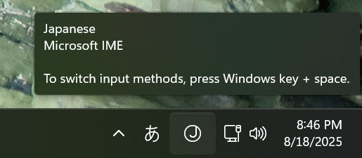
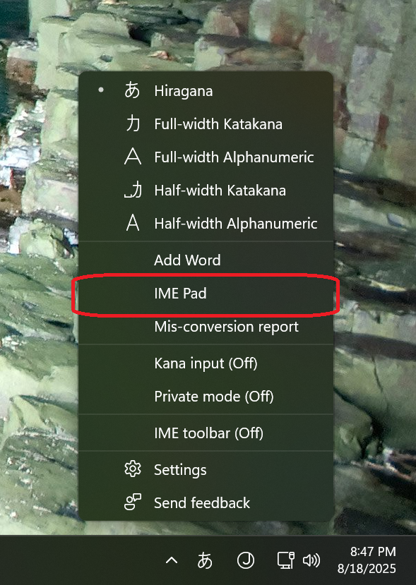

# IVS Setup Guide - Ideographic Variant Selector for Windows & macOS

## Overview

This guide explains how to use Ideographic Variant Selector (IVS) with the Mengshen pinyin font on both Windows and macOS. IVS allows you to manually switch between different pinyin readings for homograph characters (多音字).

## Prerequisites

### For Windows

- Windows 10 or later
- Japanese language pack installed (see installation steps below)
- Microsoft IME installed
- Mengshen pinyin font installed

### For macOS

- macOS 10.12 or later
- Mengshen pinyin font installed

## Step-by-step Instructions

## Windows Instructions

### 0. Install Japanese Language Pack (If Needed)

If you don't see the Japanese IME in your language bar:

1. Open Settings (`Windows + I`) → Time & Language → Language
2. Click "Add a language" → Select "Japanese (Japan)" → Install
3. Sign out and sign back in

### 1. Open IME Pad

Through Microsoft IME, you can access the IME Pad to insert IVS characters. Follow these steps:

1. Right-click on the IME language indicator in the taskbar

   

2. Select "IME Pad" from the context menu

   

### 2. Access IVS Characters

1. In the Character Map window:
   - Select the Mengshen pinyin font from the Font dropdown
   - Navigate to the Unicode range for IVS characters
   - Look for variation selectors (typically in the range U+E0100-U+E01EF)

### 3. Using IVS with Chinese Characters

1. Type the base Chinese character first
2. Immediately after, insert the IVS character using one of these methods:
   - Copy from Character Map and paste
   - Use `Alt + numpad` codes if available
   - Use Unicode input method (`Alt + X` after typing the hex code)

### 4. Alternative Method: Direct Unicode Input

1. Type the Chinese character
2. Type the IVS code (e.g., E0100)
3. Press `Alt + X` to convert the hex code to the IVS character

## macOS Instructions

### 1. Open Character Viewer

1. **Using keyboard shortcut (Recommended)**
   - Press `Control + Command + Space` to open Character Viewer
   - Or go to Edit menu → Emoji & Symbols in most applications
   - For detailed instructions, see [Apple's official guide](https://support.apple.com/en-us/102650#:~:text=Control%E2%80%93Command%E2%80%93Space%20bar)

2. **Alternative method**
   - Go to System Preferences → Keyboard
   - Check "Show keyboard and emoji viewers in menu bar"
   - Click the keyboard icon in menu bar → Show Character Viewer

### 2. Navigate to IVS Characters

1. In the Character Viewer:
   - Click on the gear icon (⚙️) in the top-left
   - Select "Customize List..."
   - Enable "Code Tables" category
   - Navigate to "Variation Selectors" or search for specific IVS codes

### 3. Using IVS with Chinese Characters

1. Type the base Chinese character first
2. From Character Viewer, double-click the desired IVS character
3. The IVS character will be inserted (invisibly) after your Chinese character
4. The pinyin will change automatically in supported applications

### 4. Alternative Method: Unicode Hex Input

1. Enable Unicode Hex Input in System Preferences → Keyboard → Input Sources
2. Type the Chinese character
3. Hold `Option` and type the IVS hex code (e.g., E0100)
4. Release `Option` to insert the IVS character

## IVS Code Information

> [!IMPORTANT]
> IVS codes start from E0100 and follow this order. These codes are selected from the end of the IVS range (E0100+) to avoid conflicts with existing standardized IVS implementations.

| IVS Code | Glyph Type | Description |
|----------|------------|-------------|
| E0100 | hanzi_glyf.ss00 | Chinese character glyf without Pinyin. Pinyin can be changed by simply changing the IVS code. |
| E0101 | hanzi_glyf.ss01 | (When Chinese character has the variational pronunciation) Chinese character glyf with the standard pronunciation (duplicates with hanzi_glyf, but replaces it by overriding GSUB replacements) |
| E0102 | hanzi_glyf.ss02 | (When Chinese character has the variational pronunciation) After that, Chinese character glyf with the variational pronunciation |
| E0103+ | hanzi_glyf.ss03+ | Additional variational pronunciations |

For detailed information about IVS codes and their specifications, see the [Specifications (Constraints)](./HOW_TO_MAKE_EN.md#specifications-constraints) section in the font generation guide.

## Example Usage

For the character 行 (háng/xíng):

- Type: 行
- Add IVS selector for desired pronunciation
- The pinyin will change automatically in applications that support the font

### Demo Videos

**Windows:**
<video src="https://github.com/user-attachments/assets/19b9a839-2504-4f44-96ea-ec28b3836865">
Your browser does not support the video tag.
</video>

**macOS:**
<video src="https://github.com/user-attachments/assets/62c5567e-5ba0-48b0-b196-fd3db5322dae">
Your browser does not support the video tag.
</video>

## Supported Applications

- Microsoft Word (requires OpenType features enabled)
- Microsoft Excel (works by default)
- Modern web browsers
- Text editors with Unicode support

## Troubleshooting

### IVS not working?

1. Ensure the Mengshen font is properly installed
2. Check that the application supports OpenType features
3. Verify the IVS character was inserted correctly (should be invisible)

### Character Map not showing IVS?

1. Make sure you've selected the correct font
2. Try scrolling to different Unicode ranges
3. Use "Advanced view" in Character Map for more options

## Reference

This guide is based on information from: [MS-IMEでIVSを利用する方法](https://qiita.com/Qiibow/items/997f9c6a95cd1286f8c3#4ms-ime%E3%81%A7ivs%E3%82%92%E5%88%A9%E7%94%A8%E3%81%99%E3%82%8B%E6%96%B9%E6%B3%95)

## See Also

- [Microsoft Word Setup for Homograph Features](./MICROSOFT_WORD_SETUP.md)
- [Supported Homographs List](./DUOYINZI_DICTIONARY.md)
