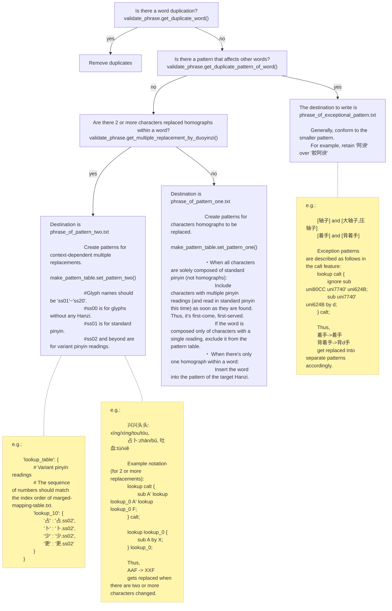

# About homograph (多音字)

- the pattern one is a pattern that pinyin changes only 0 to 1 character in an idiom.  
- the pattern two is patterns in which the pinyin changes for two or more characters in an idiom.  
- exception pattern is a pattern except above.

# File Structure

```text
outputs
   ├── duoyinzi_pattern_one.txt          <- Generated by make_pattern_table.py
   ├── duoyinzi_pattern_two.json         <- Generated by make_pattern_table.py
   └── duoyinzi_exceptional_pattern.json <- Used only for exceptional patterns
```

Currently, duoyinzi_exceptional_pattern.json is generated manually.
-> [Generation location](https://github.com/MaruTama/Mengshen-pinyin-font/blob/e5d6e9e1770d849d6c17016683faf7c04d028473/res/phonics/duo_yin_zi/scripts/make_pattern_table.py#L237-L276)

## About the `order` number in duoyinzi_pattern_one.txt

Each line has the form `order, character, pinyin, [patterns...]`. The
leading `order` is the position (index + 1) of that pinyin within
`merged-mapping-table.txt` — the list of readings for that character,
which corresponds to the font's `ss` glyph slots. It is **not** a
sequential count renumbered over only the readings that have patterns.

Because of this, if a character has a reading with no pattern (e.g. a
rare variant reading with no idiom examples) sitting between other
readings, the `order` numbers in the output will have gaps.

For example, `豁` (U+8C41) has four readings in this order in
`merged-mapping-table.txt`: `huò, huá, huō, hè`. `huá` has no idiom
examples in the phrase dictionaries (`phrase_of_pattern_one.txt`, etc.),
so no pattern can be built for it and it never appears as a line in
`duoyinzi_pattern_one.txt`. But `huō` is still the 3rd reading in
order (`huò`=1, `huá`=2, `huō`=3), so its `order` must be `3`,
not `2`:

```text
1, 豁, huò, [~亮|~免|~然|~达]
3, 豁, huō, [~口|~出去]
```

If an idiom (or a real name, etc.) can be found for a pattern-less
reading, adding one line to `phrase_of_pattern_one.txt` and re-running
`make_pattern_table.py` closes that gap. This actually happened for
`种` (U+79CD): its `chóng` reading (the surname `种` of a Northern Song
general) had no idiom example and left a gap, until the historical name
`种谔` (Chóng È) was added as a pattern, making the numbering run
`1, 种, zhǒng` → `2, 种, chóng` → `3, 种, zhòng` without a gap.

Since `order` maps directly to the font's `ss` slot number, when
modifying `export_pattern_one_table()` in `make_pattern_table.py`, or
editing this file by hand, **always keep the numbering aligned with
the reading order in `merged-mapping-table.txt`**, regardless of
whether a reading has a pattern or not. Renumbering it as a plain
sequential count causes a mismatch with the GSUB `ss` reference and
results in the wrong pinyin variant being substituted (this actually
happened before; see the commit
`fix: correct GSUB ss indices to match merged-mapping-table reading order`).

```text
.
├── phrase_of_exceptional_pattern.txt <- Collection of idioms containing exceptional replacement patterns (Editable)
├── phrase_of_pattern_one.txt         <- Collection of idioms where only 0-1 characters change in pinyin (Editable)
├── phrase_of_pattern_two.txt         <- Collection of idioms where 2 or more characters change in pinyin (Editable)
├── phrase_testcase.txt               <- Test cases used to verify if validate_phrase.py works effectively
└── scripts
    ├── check_exsit_duoyinsi_on_word.py
    ├── make_pattern_table.py
    ├── phrase.py
    ├── phrase_holder.py
    ├── pinyin_getter.py
    └── validate_phrase.py
```

# Generation Procedure

```sh
# First, check the dictionary
$ python validate_phrase.py

# Generate pattern table
$ python make_pattern_table.py
```

## Overview of make_pattern_table.py


