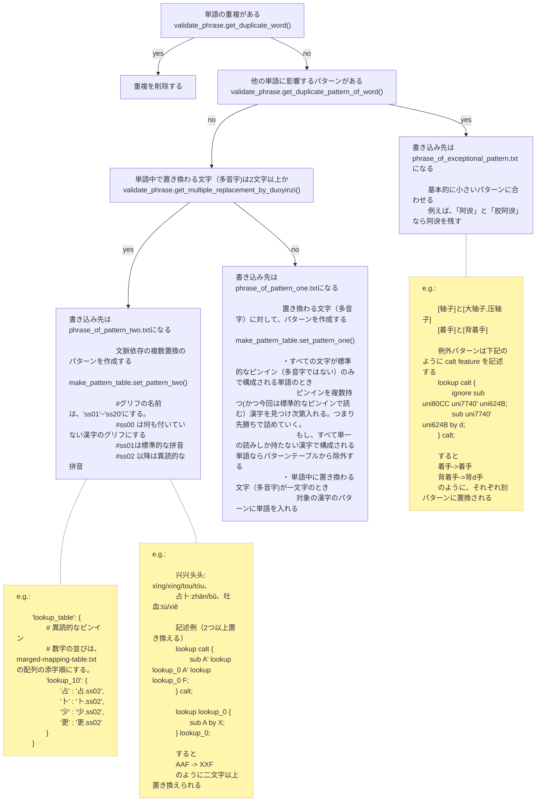

# 多音字について

pattern one は 熟語の中で 0~1 文字だけ拼音が変化するパターン  
pattern two は 熟語の中で 2 文字以上拼音が変化するパターン  
exception pattern は 例外的なパターン  

# ファイル構成

```text
outputs
   ├── duoyinzi_pattern_one.txt          <- make_pattern_table.py によって生成される
   ├── duoyinzi_pattern_two.json         <- make_pattern_table.py によって生成される
   └── duoyinzi_exceptional_pattern.json <- 特別なパターンのみで使う
```

現在は、duoyinzi_exceptional_pattern.json の生成は手動にて生成している.
-> [生成箇所](https://github.com/MaruTama/Mengshen-pinyin-font/blob/e5d6e9e1770d849d6c17016683faf7c04d028473/res/phonics/duo_yin_zi/scripts/make_pattern_table.py#L237-L276)

## duoyinzi_pattern_one.txt の番号（order）について

各行は `order, 漢字, 拼音, [パターン...]` の形式で、先頭の `order` は
その拼音が `merged-mapping-table.txt`（＝その漢字が持つ読みのリスト、GSUB の
`ss` 番号に対応）の中で何番目に登録されているか（添字 + 1）を表す。
パターンを持つ読みだけを連番で振り直したものではない。

そのため、ある漢字の読みの中にパターンを持たない読み（用例が乏しい異読み等）
が挟まっていると、`order` の番号は欠番を含んだまま歯抜けになる。

例えば `豁`（U+8C41）は `merged-mapping-table.txt` 上で
`huò, huá, huō, hè` の順で4つの読みを持つが、`huá` は熟語辞書
（`phrase_of_pattern_one.txt` 等）に用例が無くパターンを作れないため、
`duoyinzi_pattern_one.txt` には行として出力されない。しかし `huō` は
読み順で3番目（`huò`=1, `huá`=2, `huō`=3）なので、`order` は
`2` ではなく `3` になる。

```text
1, 豁, huò, [~亮|~免|~然|~达]
3, 豁, huō, [~口|~出去]
```

もしパターン無しの読みに用例（実在の熟語・人名等）を追加できるなら
`phrase_of_pattern_one.txt` に1行追加して `make_pattern_table.py` を
再実行すれば、その番号の歯抜けは解消される。実際に `种`（U+79CD）は
かつて `chóng` 読み（北宋の武将の姓氏「种」）の用例が無く歯抜けだったが、
史実の人名 `种谔`（Chóng È）をパターンとして追加したことで
`1, 种, zhǒng` → `2, 种, chóng` → `3, 种, zhòng` と連続するようになった。

この `order` がフォント内の `ss` スロット番号と直接対応しているため、
`make_pattern_table.py` の `export_pattern_one_table()` を書き換える場合や
手動でこのファイルを編集する場合は、パターンの有無に関わらず
**読み順（merged-mapping-table.txt の並び）に揃えた番号を維持すること**。
連番に詰め直すと GSUB の `ss` 参照とズレて誤った拼音バリアントに
置換される（過去に実際発生した不具合。詳細はコミット
`fix: correct GSUB ss indices to match merged-mapping-table reading order` を参照）。

```text
.
├── NOTE.md
├── phrase_of_exceptional_pattern.txt <- 例外的な置換パターンを含む熟語集（編集可能）  
├── phrase_of_pattern_one.txt         <- 熟語の中で 0~1文字だけ拼音が変化する熟語集（編集可能）  
├── phrase_of_pattern_two.txt         <- 熟語の中で 2文字以上拼音が変化する熟語集（編集可能）
├── phrase_testcase.txt               <- validate_phrase.py が有効的に働くかどうかの確認に使ったテストケース
└── scripts
    ├── check_exsit_duoyinsi_on_word.py
    ├── make_pattern_table.py
    ├── phrase.py
    ├── phrase_holder.py
    ├── pinyin_getter.py
    └── validate_phrase.py
```

# 生成手順

```sh
# 最初に辞書のチェックを行う
$ python validate_phrase.py

# パターンテーブル生成
$ python make_pattern_table.py
```

## make_pattern_table.py の概略


